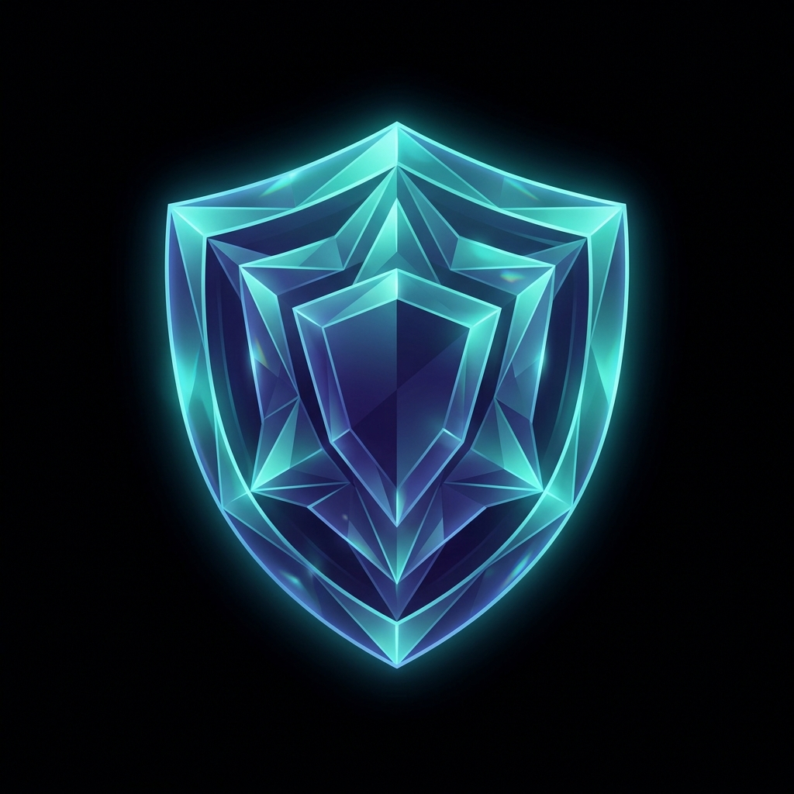

# VaultDrop: Zero-Knowledge Secure File Storage

VaultDrop is a modern, end-to-end encrypted (E2EE) file storage platform designed for individuals and teams who prioritize data privacy above all else. Built with the "Blind Vault" architecture, VaultDrop ensures that your data is encrypted **before** it leaves your browser, and your private keys **never** touch our servers.



## 🛡️ Key Security Features

- **Zero-Knowledge Encryption**: The server only ever sees encrypted ciphertext. We have no way to read your files.
- **Client-Side Crypto**: RSA-OAEP for key exchange and AES-256-GCM for file data, all performed in the browser via WebCrypto.
- **Volatile Secret Management**: Encryption keys for large file uploads are stored in **Redis** and permanently wiped once the transfer is complete.
- **Blind Vault Architecture**: The server's memory is transient—once an upload finishes, the server loses the "formula" to decrypt the folder.
- **Public Key Verification**: Cryptographically verified device registration using standardized SPKI hashing.

## 🚀 Tech Stack

- **Frontend**: [React](https://reactjs.org/), [Vite](https://vitejs.dev/), [TailwindCSS](https://tailwindcss.com/)
- **Backend**: [Node.js](https://nodejs.org/), [Koa](https://koajs.com/), [TSOA](https://github.com/lukeautry/tsoa)
- **Database**: [PostgreSQL](https://www.postgresql.org/) with [Prisma ORM](https://www.prisma.io/)
- **Caching & Vaulting**: [Redis](https://redis.io/)
- **Cryptography**: [WebCrypto API](https://developer.mozilla.org/en-US/docs/Web/API/Web_Crypto_API), [Node.js Crypto Module](https://nodejs.org/api/crypto.html)

## 🛠️ Project Hierarchy

```text
├── api/                  # Node.js / Koa Backend
│   ├── src/api/          # Domain Logic (Auth, FS, Upload)
│   ├── src/lib/crypto/   # Secure Hashing and Key Management
│   └── prisma/           # Database Schema & Migrations
├── vite/                 # React / Vite Frontend
│   ├── src/lib/crypto/   # Browser-side RSA/AES Engine
│   └── src/dialog/       # Secure Overlays (Webcam, Key Creation)
└── doc/                  # System Architecture & Documentation
```

## 🏗️ Getting Started

### Prerequisites

- Node.js (v18+)
- Docker (for PostgreSQL & Redis)
- npm or yarn

### 1. Setup Backend
```bash
cd api
npm install
npm run dev:startdb     # Start PostgreSQL & Redis via Docker
npx prisma migrate dev  # Set up database schema
npm run dev             # Start API at http://localhost:8080
```

### 2. Setup Frontend
```bash
cd vite
npm install
npm run dev             # Open http://localhost:5173
```

## 🛡️ Responsible Security 

VaultDrop uses industry-standard algorithms:
- **RSA-OAEP 2048**: Asymmetric encryption for secure key sharing.
- **AES-GCM 256**: Authenticated symmetric encryption for high-speed file data processing.
- **SHA-256**: Standardized SPKI hashing for public key identity verification.

---

© 2026 VaultDrop | [GitHub Repo](https://github.com/sahilmangtani12/VaultSecure)
